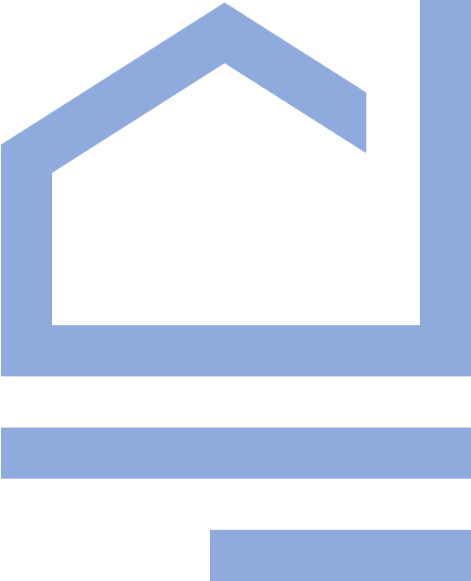

    

## 플레이스 매칭 커뮤니티 '동세권'
- 현재 위치를 기반으로 유저들이 다양한 오프라인 장소를 직접 선택하여 함께 즐길 수 있는 플랫폼
- 원하는 유저들과 함께 매칭을 이뤄 여러 핫플을 가보세요!

## toPangyo
### 💫 Member
---
- 💁🏻 우명규 <strong style="color : yellow;">FE</strong>
- 💁🏻 최성민 <strong style="color : yellow;">BE</strong>
- 💁🏻‍♀️ 류나연 <strong style="color : yellow;">FE</strong>
- 💁🏻 선원종 <strong style="color : yellow;">BE</strong>
- 💁🏻‍♀️ 전혜지 <strong style="color : yellow;">BE</strong>

### 💫 Team Goals
---
- LCP 2.5초 이내로 최적화하기
- 정해진 기간 내에 서버를 MSA 아키텍쳐로 구현하기

## 동세권
> 동세권 프로젝트의 전체적인 구조입니다.
### 📄 기능
---
- 매칭
    - 매칭방 CRUD
    - 카테고리 분류
    - 검색
- 채팅
    - 메시지 송/수신
    - 방장 권한
    - 입/퇴장 기능
- 알림
    - 알림 전송
    - 알림 받기
- 유저
    - 로그인
    - 회원가입
    - 프로필 설정
- 포스팅
    - 모집글 CRUD
    - 시간 및 장소 설정
    - 신청 기능

### 💻 Architecture
---

    

### 🛠 Skills
---
- Front-end
    - React.js
    - SCSS
    - Redux
    - Kakao map API
    - axios
    - Figma
- Back-end
    - Node.js
    - express
    - NginX
    - Socket.io
    - MariaDB
    - MongoDB
    - redis
    - gitbook
    - Insomnia

### 🏃🏻 Notion
<a href="https://devcamp.notion.site/toPangyo-3535f9f859ca4bbbb71cc4a89dcd694f" style="text-decoration : none; font-size:20px; color : white;">팀원들과 열심히 노력한 흔적 보러가기!</a>

